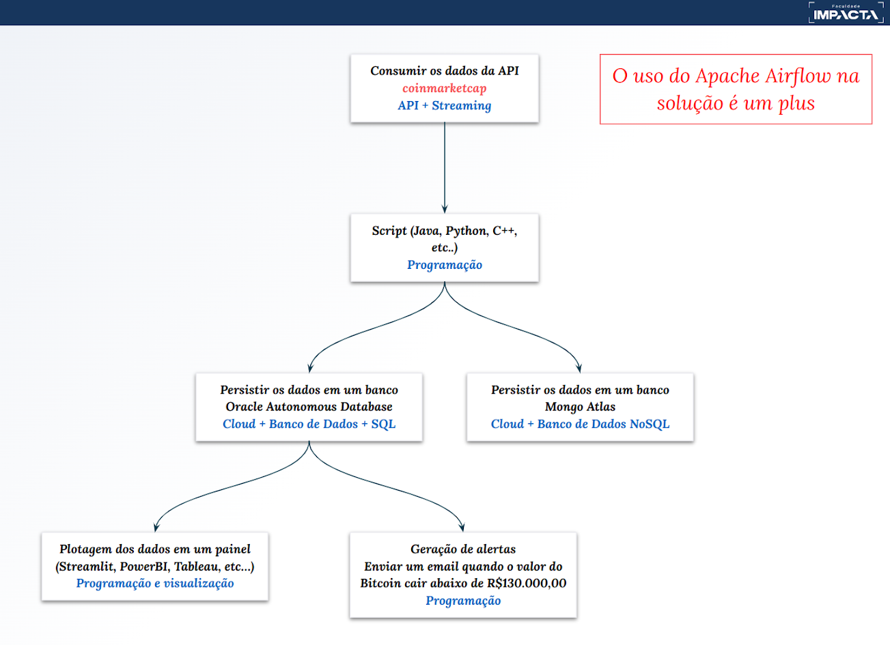

# Projeto da disciplina de BigData

O objetivo deste projeto (diagrama na imagem em anexo) é aplicar na prática o conhecimento técnico obtido ao longo desta disciplina em um projeto de engenharia de dados do mundo real que envolve ingestão, transformação e armazenamento de dados. 

A seguir uma breve descrição dos tópicos que serão abordados:

- **Pipeline de dados:** Construir um pipeline de dados que ingere dados de uma fonte, os transforma e os carrega em um armazenamento de dados. Use ferramentas como Apache Airflow ou Apache NiFi.
- **Modelagem de dados e design de banco de dados:** Construa um modelo de dados e projete um esquema de banco de dados. Use ferramentas como Diagrama de Relacionamento de Entidade para criar uma representação visual do modelo de dados.
- **Qualidade de dados:** Aplique medidas de controle de qualidade de dados.
- **Visualização de dados:** Crie uma visualização de dados usando uma ferramenta de inteligência de negócios como Tableau ou Power BI. 



## Instalação do projeto

### Ambiente
Criar o arquivo com as variáveis de ambiente e preenchê-lo conforme os passos a seguir:

```
cp dags/.env.example dags/.env
```

### API's
- Acesse [http://www.coinmarketcap.com](http://www.coinmarketcap.com) e [https://www.alphavantage.co](https://www.alphavantage.co) e gere as api_key
- Edite o arquivo .env gerado no passo anterior e coloque as chaves das apis nas variaveis ALPHAVANTAGE_API_KEY e COINMARKETCAP_API_KEY

### Banco de dados Oracle Autonomous 

- Entrar no oracle cloud: https://cloud.oracle.com/
- Criar um banco Autonomous Database
- Criar as tabelas baseado no arquivo resources/oracle/dump.sql
- Baixar as credenciais (wallet) e salvar no diretório oracle_wallet:
```
mkdir oracle_wallet
unzip Wallet_dbcryptos.zip .
```

### Instalação do Apache Airflow
- Instalar o Apache Airflow através do Docker:
```
echo -e "AIRFLOW_UID=$(id -u)" > .env
mkdir logs && mkdir plugins
docker compose up airflow-init
docker compose up --build
```

- Acessar o Airflow e rodar a dag 'criptomoedas' ou a 'btc': http://localhost:8080/.

### Instalação do Tableu

Instale o [Tableu Desktop](https://www.tableau.com/products/desktop) e abra o projeto localizado no diretório 'resources/tableau/'

### Script que dispara e-mail se o valor do Bitcoin estiver abaixo de R$ 130.000,00

- Caso esteja rodando o docker, foi criado um container contendo o [Mailpit](https://github.com/axllent/mailpit) para que ele monte um servidor SMTP e seja possível visualizar os e-mails disparados em sua interface gráfica. Para tal, preencha no .env o IP do docker. Caso não esteja usando o docker, preencha no .env o endereço do servidor smtp.

- Para rodar o script:

```
python3 resources/python/btc.py
```

- Para acessar o Mailpit e ver os e-mails disparados acesse http://localhost:8025